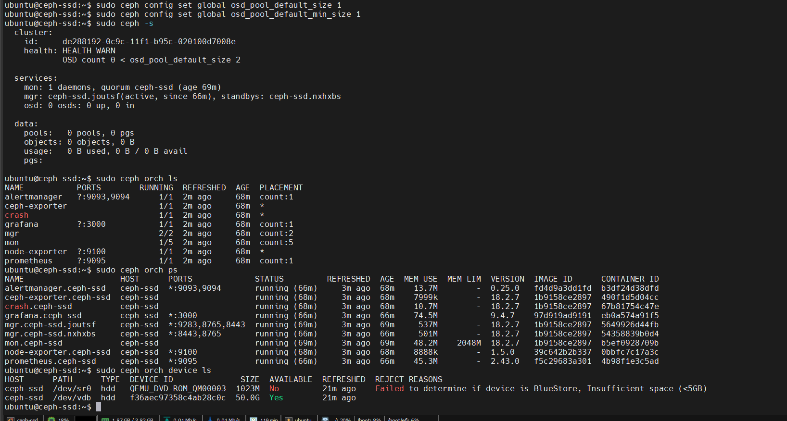

# Phase 3: Bootstrap the Cluster

Bootstrapping is the process of creating your first Ceph cluster. This single command will:

1. Create the initial Ceph cluster configuration
2. Deploy the first Monitor daemon
3. Deploy two Manager daemons
4. Generate authentication keys
5. Initialize the cluster file system
6. Start the Ceph Dashboard

## Bootstrap Command

```bash
sudo cephadm bootstrap \
  --mon-ip 192.168.16.51 \
  --single-host-defaults
```

### Parameters Explained

- `--mon-ip 192.168.16.51` — IP address of the Monitor daemon. Use your actual IP address (or hostname if DNS is configured).

- `--single-host-defaults` — Special flag for single-node clusters. Sets:
  - `osd_crush_chooseleaf_type = 0` (allows placing replicas on the same host)
  - `osd_pool_default_size = 2` (only 2 replicas instead of 3)
  - Disables unnecessary standby manager modules
  - Optimizes for single-host deployments

## Expected Output

Bootstrap will output something like:

```
✓ Ceph Monitor quorum established
✓ Installed Ceph base packages
✓ Started Ceph Manager
✓ MgrDashboard initialized

Ypk87uEq

Ceph Dashboard is now available at:

             URL: https://ceph-ssd:8443/
            User: admin
        Password: cmylwqga6l

Enabling client.admin keyring and conf on hosts with "admin" label
Saving cluster configuration to /var/lib/ceph/de288192-0c9c-11f1-b95c-020100d7008e/config directory
Enabling autotune for osd_memory_target
You can access the Ceph CLI as following in case of multi-cluster or non-default config:

        sudo /usr/sbin/cephadm shell --fsid de288192-0c9c-11f1-b95c-020100d7008e -c /etc/ceph/ceph.conf -k /etc/ceph/ceph.client.admin.keyring

Or, if you are only running a single cluster on this host:

        sudo /usr/sbin/cephadm shell

Please consider enabling telemetry to help improve Ceph:

        ceph telemetry on

For more information see:

        <https://docs.ceph.com/en/latest/mgr/telemetry/>

Bootstrap complete.
```

**Actual output from bootstrap:**



*Shows configuration commands, services status, and orchestration output*

### Key Information to Save

⚠️ **Save these details!**

- **Dashboard URL:** `https://ceph-ssd:8443/`
- **Dashboard User:** `admin`
- **Dashboard Password:** `cmylwqga6l` (in this example; yours will be different)
- **Cluster FSID:** `de288192-0c9c-11f1-b95c-020100d7008e` (unique identifier for your cluster)

---

## Post-Bootstrap Configuration

The cluster is now running but configured for 2 replicas (due to `--single-host-defaults`). Since we only have 1 OSD, we need to set replicas to 1.

### Step 3.1: Set Replica Size to 1

```bash
sudo ceph config set global osd_pool_default_size 1
sudo ceph config set global osd_pool_default_min_size 1
```

**What this does:**
- `osd_pool_default_size 1` — New pools will only have 1 copy of data
- `osd_pool_default_min_size 1` — Minimum replicas needed before writes succeed

**Why needed?** We only have 1 OSD, so 2 replicas would fail (Ceph can't replicate to the same OSD twice).

### Step 3.2: Verify Configuration

```bash
sudo ceph config get global osd_pool_default_size
# Should output: 1
```

---

## What Happened Behind the Scenes

1. **cephadm** created `/etc/ceph/ceph.conf` — cluster configuration file
2. **cephadm** generated `/etc/ceph/ceph.client.admin.keyring` — admin authentication key
3. **cephadm** deployed containers:
   - `ceph-mon.ceph-ssd` — the Monitor
   - `ceph-mgr.ceph-ssd.a` and `ceph-mgr.ceph-ssd.b` — two Managers
4. **Cluster FSID** was generated and stored in cluster metadata
5. **Dashboard** was initialized with random password

---

## Accessing the Cluster

From now on, run Ceph commands with:

```bash
sudo ceph -s
```

Or use the cephadm shell:

```bash
sudo cephadm shell
```

Inside the shell, you can run Ceph commands without `sudo`.

---

## Summary

After this phase, you should have:

✅ Ceph cluster bootstrapped
✅ Monitor (ceph-mon) running
✅ Two Managers (ceph-mgr) running
✅ Dashboard accessible at `https://ceph-ssd:8443/`
✅ Pool replica settings adjusted to 1

**Next:** [Verify Installation](./04-VERIFY-INSTALLATION.md)
