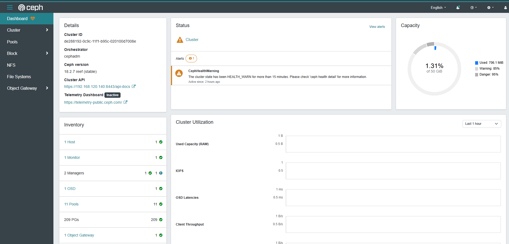
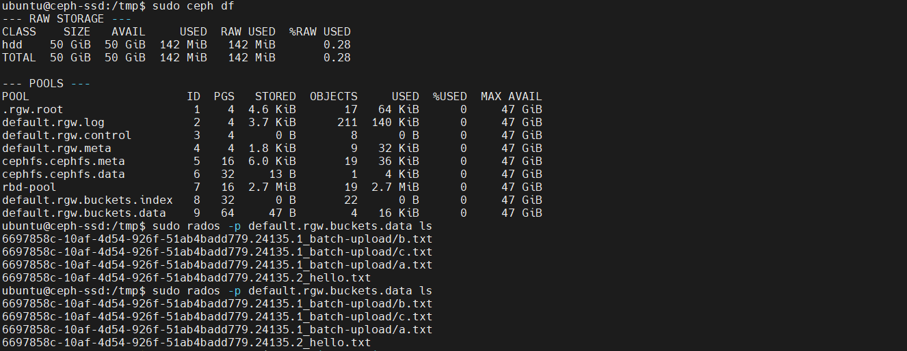

# Phase 4: Verify Installation

Now let's verify that Ceph is running correctly by installing command-line tools and checking the cluster status.

## Step 4.1: Install ceph-common

```bash
sudo apt install -y ceph-common
```

This installs Ceph client tools that let you interact with the cluster.

### If Installation Fails

If the apt installation has dependency issues, use `cephadm` to install instead:

```bash
sudo cephadm install ceph-common
```

This will download and install `ceph-common` inside a container.

---

## Step 4.2: Verify Ceph Installation

```bash
ceph -v
```

**Expected output:**
```
ceph version 18.2.4 (reef)
```

---

## Step 4.3: Check Cluster Status

```bash
sudo ceph -s
```

**Expected output (single-host cluster):**
```
  cluster:
    id:     de288192-0c9c-11f1-b95c-020100d7008e
    health: HEALTH_WARN
            OSD count 0, should be >= 1

  services:
    mon: 1 daemons, quorum ceph-ssd (age 2m)
    mgr: 2 daemons, leader ceph-ssd.a (age 2m), standbys: ceph-ssd.b
    osd: 0 osds: 0 up, 0 in

  data:
    pools:   0 pools, 0 bytes data
    objects: 0 objects, 0 B
    usage:   0 B / 0 B avail
    pgs:     0 pgs
```

**Key information:**
- **Mon (Monitor):** 1 daemon running, quorum established ✅
- **Mgr (Manager):** 2 daemons (one leader, one standby) ✅
- **OSD (Object Storage Daemon):** 0 currently (we'll add in Phase 5)
- **Health:** `HEALTH_WARN` is expected until we add an OSD

---

## Step 4.4: List Orchestrated Services

```bash
sudo ceph orch ls
```

Shows which services are deployed by cephadm.

**Expected output:**
```
NAME           RUNNING  REFRESHED  AGE  PLACEMENT
mon            1/1         1m      2m  count:1
mgr            2/2         1m      2m  count:2
```

---

## Step 4.5: Check Running Daemons

```bash
sudo ceph orch ps
```

Shows each running daemon as a container.

**Expected output:**
```
NAME                 HOST         PORTS        STATUS       REFRESHED  AGE  MEM USE  MEM LIM  VERSION
mon.ceph-ssd         ceph-ssd     [::]:6789    running      1m ago     2m    60.0M   16.0G   18.2.4
mgr.ceph-ssd.a       ceph-ssd     *:7000       running      1m ago     2m    35.0M   16.0G   18.2.4
mgr.ceph-ssd.b       ceph-ssd                  running      1m ago     2m    30.0M   16.0G   18.2.4
```

---

## Step 4.6: Access the Dashboard

The Ceph Dashboard is now running! Access it:

- **URL:** `https://ceph-ssd:8443/` (replace `ceph-ssd` with your hostname or IP)
- **Username:** `admin`
- **Password:** (from the bootstrap output)

⚠️ **Note:** The dashboard uses a self-signed certificate. Your browser will warn you about this — it's safe to proceed.

**Dashboard overview with cluster status:**



*Shows cluster ID, health status, monitor/manager/OSD inventory, and capacity charts*

In the dashboard, you can:
- View cluster status visually
- Monitor OSD, monitor, and manager health
- Create and manage pools
- View performance metrics

---

## Step 4.7: Get Cluster Information

```bash
sudo ceph df
```

Shows storage utilization and pool information.

**Expected output:**



*Shows raw storage stats and all configured pools with their usage*

(When no OSDs are added yet, pool information is empty. After adding OSD and services, pools will populate.)

---

## Troubleshooting

### If health shows HEALTH_ERR

Run:

```bash
sudo ceph health detail
```

This shows detailed health warnings.

### If a daemon isn't running

Check logs:

```bash
sudo ceph orch logs [daemon-name]
# Example:
sudo ceph orch logs mon.ceph-ssd
```

### If you need to restart a service

```bash
sudo ceph orch daemon stop [daemon-name]
sudo ceph orch daemon start [daemon-name]
# Example:
sudo ceph orch daemon restart mon.ceph-ssd
```

---

## Summary

After this phase, you should have:

✅ ceph-common installed locally
✅ Cluster status showing 1 Monitor and 2 Managers running
✅ Dashboard accessible
✅ Cluster health status understood

**Current Status:**
- **Health:** HEALTH_WARN (expected — no OSDs yet)
- **Monitors:** 1/1 running
- **Managers:** 2/2 running
- **OSDs:** 0/0 (next phase will fix this)

**Next:** [Add OSD](./05-ADD-OSD.md)
