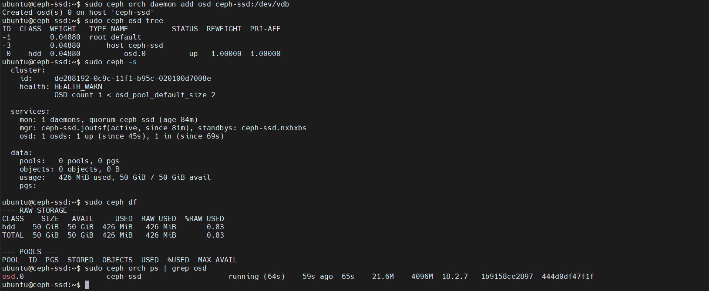

# Phase 5: Add OSD (Object Storage Daemon)

The OSD is where your actual data gets stored. Let's add a disk as an OSD.

## What is an OSD?

- **OSD** = Object Storage Daemon. It's the actual service that stores your data on disk.
- Each disk gets its own OSD daemon (1 disk = 1 OSD)
- Ceph uses **BlueStore** by default — it takes over the raw disk completely (no filesystem on it)
- When you add a disk, Ceph will partition it, create a BlueStore volume, and run an OSD container

---

## Step 5.1: List Available Disks

First, let's see what Ceph detects:

```bash
sudo ceph orch device ls
```

**Expected output:**
```
HOST         PATH      TYPE  SIZE    DEVICE  AVAIL  REJECT REASONS
ceph-ssd     /dev/sr0  cdrom  1044M  sr0           Already in use: sr0 is a CDROM drive
ceph-ssd     /dev/vdb  hdd   50G    vdb     Yes
```

**Explanation:**
- `/dev/vdb` — 50GB disk, **Available: Yes** ✅ (This is what we'll use)
- `/dev/sr0` — CD-ROM drive (ignore this)

---

## Step 5.2: Add the Disk as an OSD

```bash
sudo ceph orch daemon add osd ceph-ssd:/dev/vdb
```

### What Happens Behind the Scenes

1. Ceph calls `ceph-volume` inside a container
2. It creates a **BlueStore** partition layout on `/dev/vdb`:
   - A small partition for OSD metadata (BlueStore DB)
   - The rest for actual data storage
3. A new OSD container starts — this becomes `osd.0` (first OSD, zero-indexed)
4. The OSD registers itself with the Monitor
5. The OSD joins the CRUSH map (cluster topology)
6. The cluster becomes ready to store data

### Time to Deploy

This typically takes **30-60 seconds**. During this time:
- Ceph formats the disk
- Container starts
- OSD joins the cluster
- PGs (Placement Groups) initialize

---

## Step 5.3: Verify OSD Deployment

After waiting ~30 seconds, run:

### Check OSD Tree

```bash
sudo ceph osd tree
```

**Expected output:**



*Shows OSD hierarchy with the newly added osd.0 in "up" status*

**Explanation:**
- **ID 0:** The OSD we just added
- **Status: up** ✅ — OSD is running and available
- **Weight 50.00000** — Relative capacity (affects data distribution)

---

### Check Cluster Status

```bash
sudo ceph -s
```

**Expected output:**
```
  cluster:
    id:     de288192-0c9c-11f1-b95c-020100d7008e
    health: HEALTH_OK

  services:
    mon: 1 daemons, quorum ceph-ssd (age 1h)
    mgr: 2 daemons, leader ceph-ssd.a (age 1h), standbys: ceph-ssd.b
    osd: 1 osds: 1 up, 1 in

  data:
    pools:   0 pools, 0 bytes data
    objects: 0 objects, 0 B
    usage:   0 B / 0 B avail
    pgs:     0 pgs
```

**Good signs:**
- **Health: HEALTH_OK** ✅
- **OSD: 1 osds: 1 up, 1 in** ✅
- **Cluster is ready for data** ✅

---

### Check Disk Usage

```bash
sudo ceph df
```

**Expected output:**
```
RAW STORAGE STATS
CLASS     SIZE      AVAIL     USED   RAW USED  %RAW USED
all       50.0G     49.9G    40.0M    40.0M       0.08%
total_recovery_bytes 0
```

**Explanation:**
- **SIZE: 50.0G** — Total capacity
- **AVAIL: 49.9G** — Available space
- **USED: 40.0M** — Overhead for BlueStore

---

### Check OSD Container

```bash
sudo ceph orch ps | grep osd
```

**Expected output:**
```
osd.0                    ceph-ssd                                running      30s ago     1m    45.0M   16.0G   18.2.4
```

The OSD container is running and healthy.

---

## What's the CRUSH Map?

You might see "osd.0 joins the CRUSH map" — here's what that means:

**CRUSH** = Controlled Replication Under Scalable Hashing

- Deterministic algorithm for deciding where data goes
- Takes cluster topology into account (racks, hosts, etc.)
- For single-host, we set `osd_crush_chooseleaf_type = 0` (allows same host for replicas)

The CRUSH map placement looks like:

```
root default
  └─ host ceph-ssd
      └─ osd.0
```

---

## Summary

After this phase, you should have:

✅ Disk `/dev/vdb` formatted and configured as OSD
✅ OSD daemon (`osd.0`) running
✅ Cluster health: **HEALTH_OK** ✅
✅ 50GB of storage capacity available
✅ OSD properly registered in cluster topology

---

## What's Next?

Now that we have storage, we can add services:
- **RGW** — S3-compatible object storage
- **CephFS** — Distributed filesystem
- **RBD** — Virtual block devices

**Next:** [Deploy RGW (S3-Compatible Gateway)](./06-DEPLOY-RGW.md)
