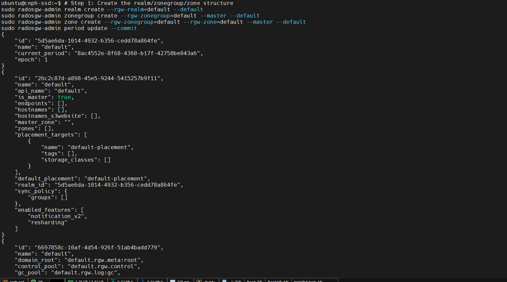
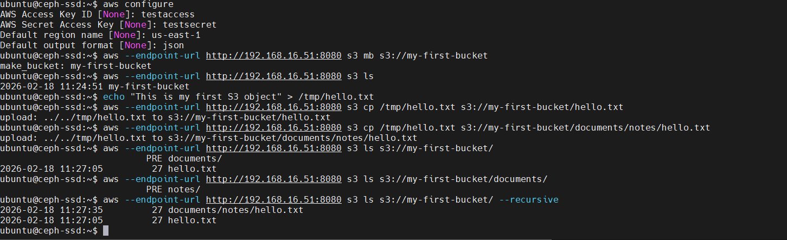
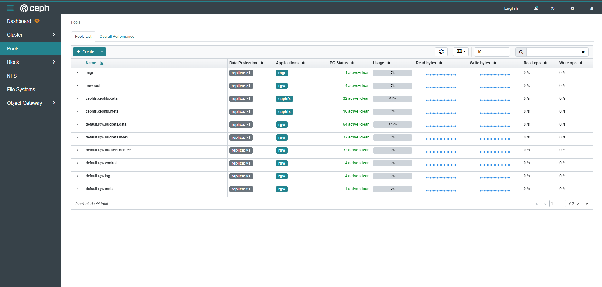
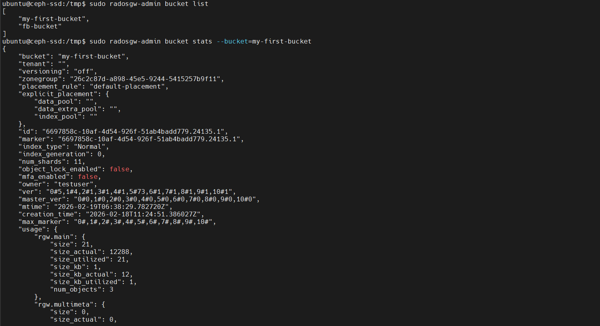

# Phase 6: Deploy RGW (S3-Compatible Object Storage Gateway)

RGW (RADOS Gateway) provides an S3-compatible API on top of Ceph, making it easy to store objects using standard S3 clients.

## What is RGW?

- **RADOS Gateway** — a daemon that speaks S3/Swift protocols
- **S3-compatible API** — applications can use standard AWS SDK/CLI
- **Object storage** — store arbitrary data (files, images, backups, etc.)
- **Swift support** — alternative protocol (less common)
- Think of it as your own **private Amazon S3**

---

## RGW Architecture Concepts

RGW uses a **realm/zonegroup/zone** hierarchy:

### Realm (top-level)
- Container for replication domains
- Used for multi-site replication
- Even single-site needs one realm

### Zonegroup
- A group of zones
- Maps to geographic region in multi-site setups
- Single-site uses one zonegroup

### Zone
- Actual storage zone where objects live
- In multi-site, zones sync across data centers
- Single-site has one zone

**For our setup:** We'll create `default` realm, `default` zonegroup, and `default` zone.

---

## Step 6.1: Create Realm, Zonegroup, and Zone

```bash
sudo radosgw-admin realm create --rgw-realm=default --default
```

Creates a realm named `default` and marks it as the default realm.

```bash
sudo radosgw-admin zonegroup create --rgw-zonegroup=default --master --default
```

Creates a zonegroup named `default`, marks it as master (authoritative), and default.

```bash
sudo radosgw-admin zone create --rgw-zonegroup=default --rgw-zone=default --master --default
```

Creates a zone named `default` in the zonegroup, marks it as master and default.

```bash
sudo radosgw-admin period update --commit
```

**What this does:** Takes all the realm/zone changes and "publishes" them so RGW daemons know the new configuration.

**Expected output:**



*Shows JSON output with realm, zonegroup, zone configuration and period update*

### Parameters Explained

- `--master` — This is the authoritative copy (not a replica)
- `--default` — Use this as the default when no specific realm/zone is specified
- `period update --commit` — Publishes the period (configuration snapshot)

---

## Step 6.2: Deploy RGW Daemon

```bash
sudo ceph orch apply rgw default default --placement="1 ceph-ssd" --port=8080
```

### Parameters Explained

- `rgw` — Service type (RGW)
- `default default` — Use realm `default`, zone `default`
- `--placement="1 ceph-ssd"` — Run 1 RGW daemon on host `ceph-ssd`
- `--port=8080` — Listen on port 8080
  - Default is port 80 (requires root)
  - We use 8080 to avoid permission issues

### Time to Deploy

Wait ~30 seconds for the RGW container to start and initialize.

---

## Step 6.3: Verify RGW Deployment

### Check Running Daemon

```bash
sudo ceph orch ps | grep rgw
```

**Expected output:**
```
rgw.default.ceph-ssd.fnztka  ceph-ssd                      running      1m ago      2m    30.0M   16.0G   18.2.4
```

The RGW daemon is running.

### Test S3 Endpoint

```bash
curl http://localhost:8080
```

**Expected output:**
```xml
<?xml version="1.0" encoding="UTF-8"?>
<ListBucketResult xmlns="http://s3.amazonaws.com/doc/2006-03-01/">
    <Name></Name>
    <Prefix></Prefix>
    <Marker></Marker>
    <MaxKeys>1000</MaxKeys>
    <IsTruncated>false</IsTruncated>
</ListBucketResult>
```

If you see XML output, the S3 endpoint is **working** ✅

### Check Cluster Status

```bash
sudo ceph -s
```

**Expected output:**
```
  cluster:
    id:     de288192-0c9c-11f1-b95c-020100d7008e
    health: HEALTH_OK

  services:
    mon: 1 daemons, quorum ceph-ssd (age 2h)
    mgr: 2 daemons, leader ceph-ssd.a (age 2h), standbys: ceph-ssd.b
    osd: 1 osds: 1 up, 1 in
    rgw: 1 daemons, 0 disabled

  data:
    pools:   4 pools, 0 objects, 0 bytes
    objects: 0 objects, 0 B
    usage:   120 MiB / 50.0 GiB avail
    pgs:     128 pgs
```

**New items:**
- **rgw: 1 daemons** — RGW is running ✅
- **4 pools** — RGW created default pools:
  - `default.rgw.control` — Control/metadata
  - `default.rgw.meta.users` — User metadata
  - `default.rgw.buckets.data` — Bucket data
  - `default.rgw.buckets.index` — Bucket index
- **128 pgs** — Placement Groups for object distribution

### Check Disk Usage

```bash
sudo ceph df
```

**Expected output:**
```
RAW STORAGE STATS
CLASS     SIZE      AVAIL     USED    RAW USED  %RAW USED
all       50.0G     49.8G    200.0M   200.0M       0.40%
total_recovery_bytes 0
```

RGW overhead visible in USED space.

---

## Using S3

Now you can create users and buckets! Here's a quick example:

### Create S3 User

```bash
sudo radosgw-admin user create --uid=testuser --display-name="Test User"
```

**Output includes:**
```
        "access_key": "EXAMPLEKEY1234567890",
        "secret_key": "examplesecretkey1234567890abcdefghijklmn"
```

### Create Bucket

With the credentials above, you can use AWS CLI:

```bash
aws s3 --endpoint-url http://localhost:8080 \
    --access-key EXAMPLEKEY1234567890 \
    --secret-key examplesecretkey1234567890abcdefghijklmn \
    mb s3://my-bucket
```

### Upload Object

```bash
echo "hello world" > test.txt
aws s3 --endpoint-url http://localhost:8080 cp test.txt s3://my-bucket/
```

**Actual S3 operations with RGW:**



*Shows AWS CLI commands for bucket creation, file uploads, and object listing*

---

## Summary

After this phase, you should have:

✅ RGW daemon running on port 8080
✅ S3 endpoint accessible at `http://localhost:8080`
✅ 4 RGW pools created
✅ Ready to create users and buckets
✅ Cluster health: **HEALTH_OK** ✅

---

## Dashboard View

In the Ceph Dashboard, you can now see:
- RGW service running
- RGW pools and usage
- User and bucket management (in some Ceph versions)

**Dashboard showing pools created by RGW:**



*Shows all RGW-created pools (default.rgw.control, default.rgw.meta, etc.) with performance metrics*

**Bucket statistics:**



*Shows bucket details including zonegroup, bucket owner, object count, and usage metrics*

**Next:** [Deploy CephFS (Distributed Filesystem)](./07-DEPLOY-CEPHFS.md)
