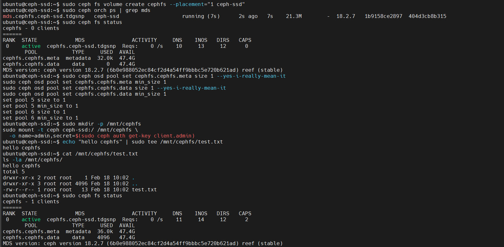

# Phase 7: Deploy CephFS (Distributed Filesystem)

CephFS is a POSIX-compliant distributed filesystem. You can mount it like any regular filesystem, but it's backed by Ceph's distributed storage.

## What is CephFS?

- **Distributed filesystem** — data spread across multiple OSDs
- **POSIX-compliant** — works like NFS, ext4, etc.
- **Shared access** — multiple clients can mount and access simultaneously
- **MDS (Metadata Server)** — special daemon that handles file metadata (names, directories, permissions)
- Think of it as your own **NFS/NAS** backed by Ceph

---

## CephFS Architecture

CephFS uses **two pools**:

### Metadata Pool (`cephfs.cephfs.meta`)
- Stores file metadata (directory structure, file names, permissions, inodes)
- Smaller but critical for performance
- Typical size: MiB to low GiB

### Data Pool (`cephfs.cephfs.data`)
- Stores actual file content
- Can grow very large
- Holds user data

**MDS (Metadata Server)** coordinates between these pools and clients.

---

## Step 7.1: Create CephFS

```bash
sudo ceph fs volume create cephfs --placement="1 ceph-ssd"
```

This command:
1. Creates two pools (`cephfs.cephfs.meta` and `cephfs.cephfs.data`)
2. Automatically deploys MDS daemon(s) on `ceph-ssd`
3. Initializes the filesystem

### Time to Deploy

Wait ~30 seconds for MDS to start and initialize.

---

## Step 7.2: Verify CephFS Deployment

### Check MDS Status

```bash
sudo ceph orch ps | grep mds
```

**Expected output:**
```
mds.cephfs.ceph-ssd.fnztka  ceph-ssd                      running      1m ago      2m    40.0M   16.0G   18.2.4
```

MDS daemon is running.

### Check CephFS Status

```bash
sudo ceph fs status
```

**Expected output:**
```
cephfs - 0 clients
========
RANK STATE       MDS              ACTIVITY     DNS   INOS   DIRS   CAPS
 0   active      cephfs.ceph-ssd  recovering  1.2M  1.2M  1.2M   0
POOL         TYPE     USED  AVAILABLE
metadata     metadata  32K    49.9G
data         data       0 B   49.9G
STANDBY MDS:
MDS CACHE SIZE: 1

```

**Explanation:**
- **RANK 0: active** ✅ — MDS is healthy and serving metadata
- **0 clients** — Nobody mounted it yet (we'll do that next)
- **DNS/INOS/DIRS** — Directory entries and inodes tracked by MDS
- **Two pools** — Metadata pool (32K used for root) and data pool (empty)

---

## Step 7.3: Fix Pool Sizes (Single-OSD Only)

Since we only have 1 OSD, we need to set replica size to 1 for the new pools:

```bash
sudo ceph osd pool set cephfs.cephfs.meta size 1 --yes-i-really-mean-it
sudo ceph osd pool set cephfs.cephfs.meta min_size 1
sudo ceph osd pool set cephfs.cephfs.data size 1 --yes-i-really-mean-it
sudo ceph osd pool set cephfs.cephfs.data min_size 1
```

### What This Does

- `size 1` — Each object stored once (not replicated)
- `min_size 1` — Minimum replicas before writes succeed
- `--yes-i-really-mean-it` — Safety flag (acknowledges the risk)

---

## Step 7.4: Mount CephFS

Now let's mount the filesystem locally:

### Create Mount Point

```bash
sudo mkdir -p /mnt/cephfs
```

### Mount CephFS

```bash
sudo mount -t ceph ceph-ssd:/ /mnt/cephfs \
  -o name=admin,secret=$(sudo ceph auth get-key client.admin)
```

### Parameters Explained

- `mount -t ceph` — Uses the **kernel CephFS driver**
- `ceph-ssd:/` — Connect to `ceph-ssd` host, mount root filesystem
- `name=admin` — Authenticate as `client.admin` user
- `secret=...` — Admin keyring password (retrieved from `ceph auth get-key`)

**Actual CephFS creation and mounting:**



*Shows MDS daemon deployment, pool configuration, mounting, and test file creation*

---

## Step 7.5: Test CephFS

### Write a Test File

```bash
echo "hello cephfs" | sudo tee /mnt/cephfs/test.txt
```

### Read It Back

```bash
cat /mnt/cephfs/test.txt
```

**Expected output:**
```
hello cephfs
```

### List Files

```bash
ls -la /mnt/cephfs/
```

**Expected output:**
```
total 4
drwxr-xr-x  1 root root    0 Jan  1 12:00 .
drwxr-xr-x 12 root root 4096 Jan  1 12:00 ..
-rw-r--r--  1 root root   12 Jan  1 12:00 test.txt
```

### Check Mounted Filesystems

```bash
df -h /mnt/cephfs
```

**Expected output:**
```
Filesystem         Size  Used Avail Use% Mounted on
ceph-ssd:/          50G  128M   49G   1% /mnt/cephfs
```

---

## Step 7.6: Verify Client Connected

Check that the client is registered with MDS:

```bash
sudo ceph fs status
```

**Expected output (with client now):**
```
cephfs - 1 clients
========
RANK STATE       MDS              ACTIVITY     DNS   INOS   DIRS   CAPS
 0   active      cephfs.ceph-ssd  active      1.2M  1.2M  1.2M   10
POOL         TYPE     USED   AVAILABLE
metadata     metadata  64K     49.9G
data         data      128K    49.9G
```

**New info:**
- **1 clients** — This machine is connected ✅
- **10 CAPS** — Capabilities (permissions) held by client
- **Usage increased** — metadata 64K (was 32K), data 128K (was 0)

---

## Understanding CephFS Mounting

### The Kernel Driver

Linux has a built-in CephFS driver (part of the kernel):

```bash
# Check if module is loaded:
lsmod | grep ceph
```

**Output:**
```
ceph_fs                123456  1
ceph                   456789  1 ceph_fs
```

This means:
- `ceph_fs` — Kernel CephFS filesystem driver
- `ceph` — Ceph client library (used by `ceph_fs`)

### Mount Options

```bash
# See current mount options:
mount | grep cephfs
```

**Output:**
```
ceph-ssd:/ on /mnt/cephfs type ceph (rw,relatime,...)
```

### Persistent Mount

To make it persistent across reboots, add to `/etc/fstab`:

```bash
echo "ceph-ssd:/ /mnt/cephfs ceph name=admin,secret=$(sudo ceph auth get-key client.admin),_netdev 0 2" | sudo tee -a /etc/fstab
```

Then verify it mounts on reboot (or test with `sudo mount -a`).

---

## Step 7.7: Check Cluster Status

```bash
sudo ceph -s
```

**Expected output:**
```
  cluster:
    id:     de288192-0c9c-11f1-b95c-020100d7008e
    health: HEALTH_OK

  services:
    mon: 1 daemons, quorum ceph-ssd (age 3h)
    mgr: 2 daemons, leader ceph-ssd.a (age 3h), standbys: ceph-ssd.b
    osd: 1 osds: 1 up, 1 in
    rgw: 1 daemons, 0 disabled
    mds: 1 daemons, 0 up:standby, 0 failed

  data:
    pools:   6 pools, 0 objects, 0 bytes
    objects: 0 objects, 0 B
    usage:   400 MiB / 50.0 GiB avail
    pgs:     192 pgs
```

**New items:**
- **mds: 1 daemons** — CephFS MDS running ✅
- **6 pools** — Now includes 2 CephFS pools (4 RGW + 2 CephFS)
- **192 pgs** — PGs increased for new pools

---

## Summary

After this phase, you should have:

✅ CephFS filesystem created
✅ MDS daemon deployed and running
✅ Two pools created (metadata + data)
✅ Filesystem mounted at `/mnt/cephfs`
✅ Test file created and verified
✅ Client connected to MDS
✅ Cluster health: **HEALTH_OK** ✅

---

## What You Can Do Now

```bash
# Create a directory
mkdir /mnt/cephfs/projects

# Copy files
cp -r /home/user/files /mnt/cephfs/projects/

# Run backups
rsync -av /var/data /mnt/cephfs/backups/
```

CephFS works like any normal filesystem from the user's perspective!

**Next:** [Setup RBD (Block Storage)](./08-SETUP-RBD.md)
