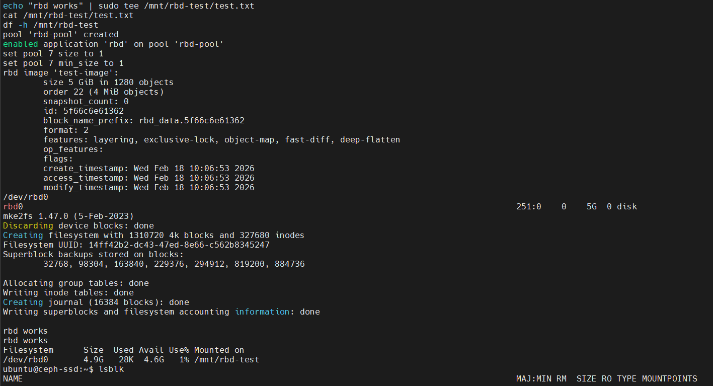

# Phase 8: Setup RBD (Block Storage)

RBD (RADOS Block Device) provides virtual block devices backed by Ceph, similar to AWS EBS volumes or QEMU disks.

## What is RBD?

- **Virtual block device** — like a virtual hard disk
- **Think of it as** AWS EBS, Proxmox storage, or QEMU-KVM disk images
- **Map to local device** — appears as `/dev/rbdX` on your system
- **Format and mount** — then use it like any regular disk
- **Features** — snapshots, clones, thin provisioning, live migration

---

## RBD vs CephFS

| Feature | RBD | CephFS |
|---------|-----|--------|
| **Access Pattern** | Block device (like hard disk) | Filesystem (shared) |
| **Clients** | Usually 1 (exclusive) | Multiple (concurrent) |
| **Use Case** | VM disks, databases, single-user | Shared storage, NFS-like |
| **Performance** | High (direct block I/O) | Good (POSIX semantics) |

---

## Step 8.1: Create RBD Pool

RBD needs a dedicated pool. Let's create one:

```bash
sudo ceph osd pool create rbd-pool 32
```

### Parameters

- `rbd-pool` — Pool name
- `32` — Number of Placement Groups (PGs)
  - Formula: `(osds * 100) / replication_factor`
  - For 1 OSD, size 1: 32 is reasonable

### Enable RBD Application

```bash
sudo ceph osd pool application enable rbd-pool rbd
```

This tells Ceph this pool is used for RBD.

### Initialize RBD Pool

```bash
sudo rbd pool init rbd-pool
```

Prepares the pool for RBD images.

---

## Step 8.2: Fix Pool Size (Single-OSD Only)

```bash
sudo ceph osd pool set rbd-pool size 1 --yes-i-really-mean-it
sudo ceph osd pool set rbd-pool min_size 1
```

Sets replica count to 1 (required for single OSD).

---

## Step 8.3: Create RBD Image

Create a 5GB virtual block device:

```bash
sudo rbd create rbd-pool/test-image --size 5G
```

### Parameters

- `rbd-pool/test-image` — Pool/image name
- `--size 5G` — Size of the virtual disk

### What is "Thin Provisioned"?

**Important:** Ceph doesn't allocate 5GB upfront!

- Thin provisioned — space used only as data is written
- Example: You create a 100GB image but only use 5GB on a 50GB system
- As long as you don't write more than available space, it works
- Think of it like a "sparse file"

---

## Step 8.4: Inspect Image

```bash
sudo rbd info rbd-pool/test-image
```

**Expected output:**
```
rbd image 'test-image':
        size: 5 GiB
        objects: 1280
        object_size: 4 MiB
        snapshot_count: 0
        block_name_prefix: rbd_data.3ae8944a1a92
        format: 2
        features: layering, exclusive-lock, object-map, fast-diff
        op_features:
        flags:
        create_timestamp: Mon Jan 01 12:00:00 2026
        access_timestamp: Mon Jan 01 12:00:00 2026
        modify_timestamp: Mon Jan 01 12:00:00 2026
        snapshots:
```

**Explanation:**
- **size: 5 GiB** — Virtual size
- **objects: 1280** — Split into 1280 objects of 4 MiB each
- **format: 2** — Modern RBD format
- **features** — Advanced features (snapshots, clones, etc.)

---

## Step 8.5: Map Image to Local Device

```bash
sudo rbd map rbd-pool/test-image
```

This presents the RBD image as a block device to the kernel.

**Expected output:**
```
/dev/rbd0
```

The image is now accessible at `/dev/rbd0`.

### Verify Device

```bash
lsblk | grep rbd
```

**Expected output:**
```
rbd0          249:0    0   5G  0 disk
```

The device is recognized by the system!

---

## Step 8.6: Format with Filesystem

Create an ext4 filesystem on the device:

```bash
sudo mkfs.ext4 /dev/rbd0
```

This runs the standard Linux filesystem formatter.

**Expected output:**
```
mke2fs 1.46.2 (28-Feb-2023)
Creating filesystem with 1310720 4k blocks and 327680 inodes
...
Allocating group tables: done
Writing inode tables: done
Creating journal: done
Writing superblocks and filesystem metadata: done
```

---

## Step 8.7: Mount the Device

Create a mount point and mount:

```bash
sudo mkdir -p /mnt/rbd-test
sudo mount /dev/rbd0 /mnt/rbd-test
```

### Verify Mount

```bash
df -h /mnt/rbd-test
```

**Expected output:**
```
Filesystem     Size  Used Avail Use% Mounted on
/dev/rbd0      4.9G   24M  4.6G   1% /mnt/rbd-test
```

The RBD image is mounted and ready!

---

## Step 8.8: Test the Device

**Actual RBD setup and testing:**



*Shows pool creation, RBD image creation, filesystem formatting, mounting, and test verification*

### Write a Test File

```bash
echo "rbd works" | sudo tee /mnt/rbd-test/test.txt
```

### Read It Back

```bash
cat /mnt/rbd-test/test.txt
```

**Expected output:**
```
rbd works
```

### Copy Some Files

```bash
sudo cp -r /etc/ceph /mnt/rbd-test/
ls -la /mnt/rbd-test/
```

**Expected output:**
```
total 40
drwxr-xr-x  3 root root  4096 Jan 01 12:00 .
drwxr-xr-x 12 root root  4096 Jan 01 12:00 ..
drwxr-xr-x  2 root root  4096 Jan 01 12:00 ceph
-rw-r--r--  1 root root     9 Jan 01 12:00 test.txt
lost+found
```

---

## Step 8.9: Check Cluster Status

```bash
sudo ceph -s
```

**Expected output:**
```
  cluster:
    id:     de288192-0c9c-11f1-b95c-020100d7008e
    health: HEALTH_OK

  services:
    mon: 1 daemons, quorum ceph-ssd (age 4h)
    mgr: 2 daemons, leader ceph-ssd.a (age 4h), standbys: ceph-ssd.b
    osd: 1 osds: 1 up, 1 in
    rgw: 1 daemons, 0 disabled
    mds: 1 daemons, 0 up:standby, 0 failed

  data:
    pools:   7 pools, 1354 objects, 0 bytes
    objects: 1354 objects
    usage:   1.3 GiB / 50.0 GiB avail
    pgs:     224 pgs
```

**New items:**
- **7 pools** — RBD pool added ✅
- **1354 objects** — RBD image plus metadata
- **usage: 1.3 GiB** — Actual data stored (filesystem + files)

---

## Step 8.10: Check Disk Usage

```bash
sudo ceph df
```

**Expected output:**
```
RAW STORAGE STATS
CLASS     SIZE      AVAIL     USED    RAW USED  %RAW USED
all       50.0G     48.7G    1.3G    1.3G       2.60%
total_recovery_bytes 0
```

You're using 1.3GB of your 50GB capacity.

---

## Advanced RBD Features

### Snapshots

Create a point-in-time snapshot:

```bash
sudo rbd snap create rbd-pool/test-image@snapshot1
sudo rbd snap ls rbd-pool/test-image
```

### Clones

Create a copy-on-write clone:

```bash
sudo rbd clone rbd-pool/test-image@snapshot1 rbd-pool/test-image-clone
```

### Image Info

```bash
sudo rbd info rbd-pool/test-image
sudo rbd showmapped
```

---

## Cleanup (Optional)

When done with testing:

### Unmount

```bash
sudo umount /mnt/rbd-test
```

### Unmap

```bash
sudo rbd unmap /dev/rbd0
```

### Remove Image (Destructive!)

```bash
sudo rbd rm rbd-pool/test-image
```

---

## Persistent Mount

To mount RBD image on boot, add to `/etc/fstab`:

```bash
echo "/dev/rbd0 /mnt/rbd-test ext4 defaults 0 2" | sudo tee -a /etc/fstab
```

**Note:** Requires mapping first. For production, consider:
- `rbdmap` service (maps images before filesystem mount)
- Or use Kubernetes CSI RBD plugin
- Or use Proxmox/OpenStack integration

---

## Summary

After this phase, you should have:

✅ RBD pool created and configured
✅ 5GB virtual block device image created
✅ Image mapped to `/dev/rbd0`
✅ Filesystem created and mounted
✅ Test files written and verified
✅ Cluster health: **HEALTH_OK** ✅

---

## Complete Ceph Cluster Features

You now have a fully functional Ceph cluster with:

| Feature | Status |
|---------|--------|
| **Monitoring** | ✅ 1 Monitor (ceph-mon) |
| **Management** | ✅ 2 Managers (ceph-mgr) + Dashboard |
| **Object Storage** | ✅ 1 OSD (ceph-osd) with 50GB |
| **S3 Gateway** | ✅ RGW on port 8080 |
| **Distributed FS** | ✅ CephFS mounted at `/mnt/cephfs` |
| **Block Storage** | ✅ RBD mounted at `/mnt/rbd-test` |

---

## What's Next?

### For Learning
- Explore Ceph Dashboard at `https://ceph-ssd:8443/`
- Create RGW users and buckets
- Create CephFS files and directories
- Create RBD snapshots

### For Production
- Add redundant monitors (min 3)
- Add multiple OSDs across different hosts
- Setup RGW for production (SSL, load balancing)
- Configure CephFS client restrictions
- Setup monitoring and alerting (Prometheus/Grafana)
- Plan for disaster recovery

### For Integration
- Connect Kubernetes CSI drivers
- Connect OpenStack Cinder/Glance/Swift
- Connect Proxmox storage
- Setup S3 bucket replication

---

## Useful Commands Reference

```bash
# Cluster Status
sudo ceph -s                    # Cluster status
sudo ceph health detail         # Detailed health
sudo ceph df                    # Disk usage

# OSD Management
sudo ceph osd tree              # OSD hierarchy
sudo ceph osd status            # OSD status
sudo ceph osd crush show-tree   # CRUSH map

# Pool Management
sudo ceph osd pool ls           # List pools
sudo ceph osd pool stats        # Pool statistics

# RGW Management
sudo radosgw-admin bucket list  # List buckets
sudo radosgw-admin user list    # List users

# CephFS Management
sudo ceph fs status             # Filesystem status
sudo ceph fs dump               # Filesystem details

# RBD Management
sudo rbd ls -l                  # List RBD images
sudo rbd showmapped             # Show mapped images

# Orchestration
sudo ceph orch ls               # List deployed services
sudo ceph orch ps               # Show running daemons
sudo ceph orch logs [daemon]    # View daemon logs
```

---

**Congratulations!** You have successfully set up a complete Ceph cluster. 🎉

For more information, visit the [Official Ceph Documentation](https://docs.ceph.com/en/latest/)
